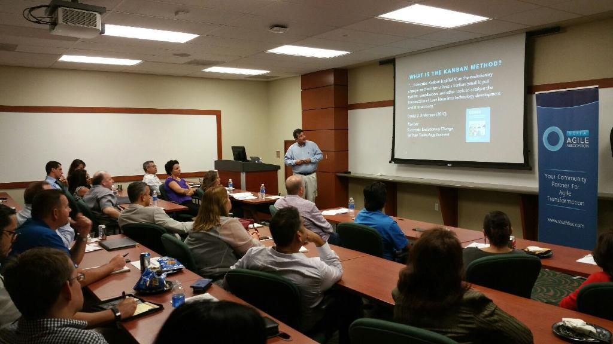

# Why Kanban
## A presentation for the South Florida Agile Association

### Summary
The benefits of going Agile are plenty: Faster speed-to-market, higher predictability, products that better meets customer needs, greater quality, improved teamwork, etc., the list is long!

Whereas many companies have embraced Scrum in their transition to Agile, others have taken on Kanban or a combination of the two, so why use Kanban?

Hear the story behind, and understand why Motionpoint decided Kanban was a better fit for them and how they transformed their organization to Kanban. What were the challenges in moving to Kanban? How did Motionpoint overcome these obstacles? What are the benefits they have realized with Kanban? What is their recommendation for someone thinking about Kanban?

Learn directly from the person who made this happen at Motionpoint. Eugenio Alvarez (Gene) is the Director of Development at MotionPoint Corp. A South Florida software development veteran with 20 plus years of experience in software construction and deployment, he has been focused on agile development methods since 2013. He is a CSM, CSPO and a LKU Lean Kanban University Alumni.

[Meetup.com presentation](https://www.meetup.com/south-florida-agile-association/events/225723683/)

[YouTube presentation](https://www.youtube.com/watch?v=p3hbStF6Oa8)

<picture>
 
</picture>

