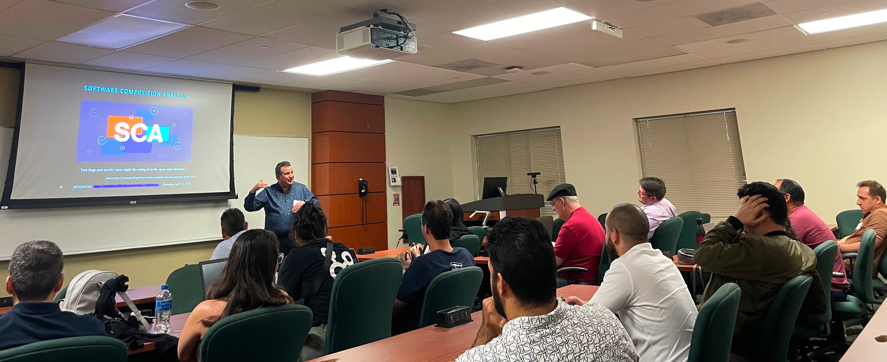

# Software Engineering Management: Integrating Software Testing
## A presentation for the South Florida Tech Hub Developer Conference 2023

### Summary

Effective software testing requires a holistic approach that considers various factors including organizational structure, methodology, architecture, budgeting, and anti-patterns. By integrating testing seamlessly into the entire software development process, organizations can ensure the delivery of high-quality software products that meet user expectations and business objectives.

[Archived SoFlo DevCon (South Florida Developer Conference) website](https://web.archive.org/web/20230605164955/https://techhubsouthflorida.org/meetups/soflodevcon/)

<picture>
 
</picture>

