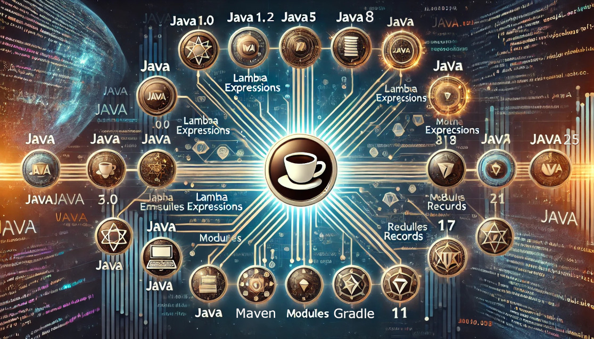

# Java Version API Use Cases 
## A presentation for the Miami Java User Group

### Summary
The Java Version API (java.lang.Runtime.Version) was introduced in version 9. The API allows numeric runtime version information to be retrieved inside a running Java application. We will cover use cases and introduce a Runtime Version backport for older versions of Java (8, 7, & 6) that illustrates one use case.

Agenda
- Compatibility (bytecode versus source code)
- Quickly switching between different Java versions
- Review Java Version API
- What are the use cases for using the Version API
- Backported Java Version API to older versions (8, 7 & 6)
- Testing between versions
- Continuous version updates versus a finish line mentality

[Meetup.com website presentation](https://www.meetup.com/miami-java-user-group/events/303809050/)

