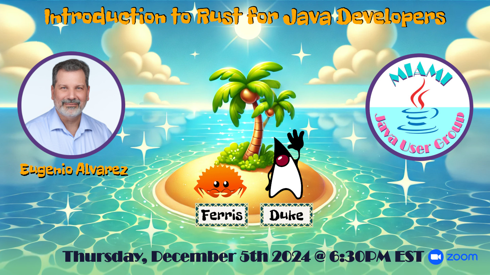

# Introduction to Rust for Java Developers 
## A presentation for the Miami Java User Group

### Summary
The Rust programming language has consistently topped Stack Overflow's annual Developer Survey as the "most-admired programming language." We will discuss why Rust is so admired, compare it to Java, and investigate Rust use cases to understand how they relate.

We will discuss
- Why is Rust so admired?
- Compare Rust to Java Ecosystems
- Compare Rust language features to Java
- Investigate Rust use cases

[Meetup.com website presentation](https://www.meetup.com/miami-java-user-group/events/304717903/)

