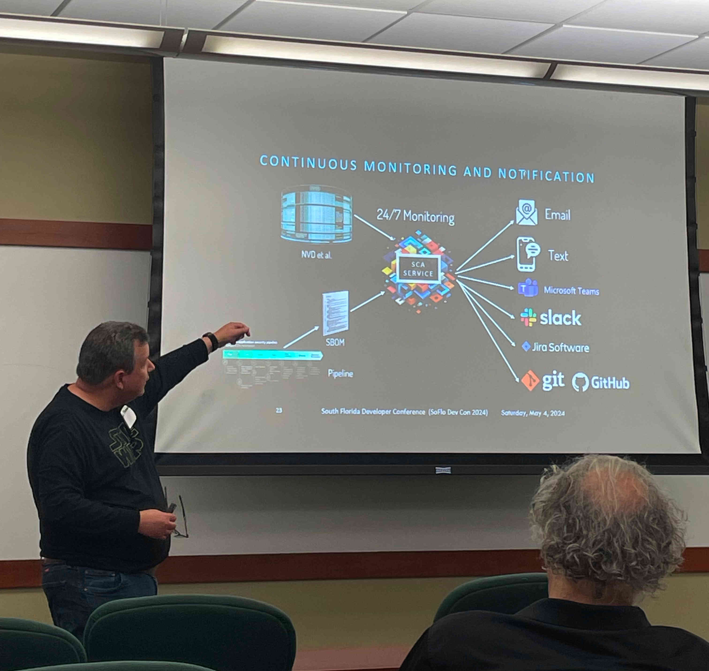

# Software Composition Analysis (SCA)
## A presentation for the 2024 South Florida Developer Conference

### Summary

Software Composition Analysis (SCA), a critical practice for identifying and managing vulnerabilities in open-source software components. An overview of SCA's role in the software development lifecycle, emphasizing its importance in today’s security-conscious world. We will explore the key challenges and best practices in implementing SCA, alongside its benefits in risk management and compliance with regulatory standards.

This presentation is an introduction to Software Composition Analysis and its necessity in modern software development. Detailed insights into how SCA tools work to detect vulnerabilities and licensing issues and key challenges and best practices in implementing SCA.

[SoFlo DevCon (South Florida Developer Conference) website snapshot](2024-SoFloDevCon-website.pdf)

